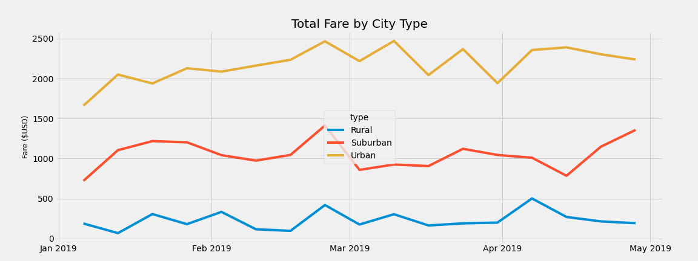

# PyBer Analysis

## Overview of the analysis: 
Pyber is a ride-sharing app company. The purpose of this analysis is to visualize ride-sharing data by city type and total weekly fares for each city type. The data was analyzed here:  [PyBer_Challenge.ipynb](https://github.com/nguyencao247/PyBer_Analysis/blob/main/PyBer_Challenge.ipynb). Charts were created from this analysis in order to tell a story. These deliverables were then used to improve access to ride-sharing services and determine affordability and accessibility for underserved neighborhoods.

## Results: 

### Summary DataFrame of Ride-sharing Data by City Type
 

The above DataFrame shows a summary of ride-sharing data by city type. The city types include: rural, suburban, and urban. The results show that as the city type changes from rural to urban, the total rides, total drivers, and total fares increases. However, the average fare per ride and average fare per driver decreases. This is probably due to those in rural areas tend to travel farther than those in urban areas. This is the cause for a higher fare per ride. Furthermore, in rural cities: there were 1.60 rides to every driver, suburban cities: there were 1.28 rides to every driver, and in urban cities: there were 0.68 rides to every driver. 

### Total Fare by City Type Line Chart
 

The above line chart shows the total weekly fares for each city type between January 1, 2019 to April 29, 2019. It is also clear here that as the city type changes from rural to urban, the total fares increases. It can be concluded that all cities have similar trends in their total weekly fares.

## Summary: 
Based on the results from this analysis, below are three business recommendations for the CEO of Pyber in addressing disparities by city types. 
1. From the summary DataFrame, urban cities are the only ones with more drivers than there are riders. This is what is causing lower fare prices in those areas. Drivers are clearly oversaturated in urban cities compared to rural and suburban cities. Drivers should be relocated or Pyber should hire more drivers for rural and suburban areas. These extra riders should be relocated to rural and suburban areas to improve affordability and accessibility. 
2. According to the multiple-line chart, all city types seem to have similar trends. To serve more riders, drivers should be mindful of these peak times (EX: end of February, beginning of April). Pyber should let their drivers know to be more available during these times to increase accessibility and revenue.
3. Since it was mentioned above that each city type has similar fare trends, when the week is a bit slower in revenue, drivers should be open to driving for other city types. This will help with accessibility since they are not as needed in their “home” city due to a “slower” week. This can also be a business model for peak times. 
